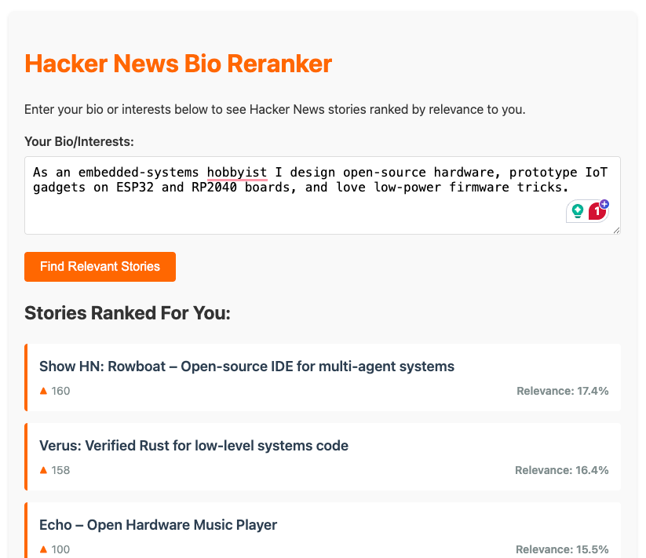

# Intro

I created two rerankers: one that uses a bi-encoder + cosine similarity with sklearn and the other that uses a cross-encoder BGE reranker `bge-reranker-large`

The BGE performs better, but it takes more time and resources. I also created an `eval.py` to compare the two using pairwise with LLM-as-judge evaluation. As expected, BGE had a higher win-rate, albeit the margins were not so big (60% win-rate).

# How does this fit into 4 hours of code development?

I used OpenAI o3 for backend development and Claude 3.7 Sonnet for the front-end development. I already knew I wanted to use a reranker model like BGE and I also knew pairwise evaluation would be a good fit for this case. So it was just a matter of asking the right questions:

- [Python code](https://chatgpt.com/share/6812421c-c15c-8004-84e9-14486503f87e)
- [Front-end work](https://claude.ai/share/552c3f7e-11c4-42f7-b1e7-11d4c5bd5b42)

The live demo would take a couple of hours, but I did the main task first and was able to reuse 95% of the code.

# Local installation

For best compatibility, use python 3.12.10.

````commandline
pip install -r requirements.txt
python bge_reranker.py
````

You can also run `python sklearn_reranker.py` for a lightweight experience

This will start a server that you can make your API request at POST http://localhost:8080/rerank

You can also quick-test a few examples by running:

````commandline
python test_api.py
````

If you are targeting `bge_reranker`, make sure to point the port to 8081.

You can also query the API through:

````commandline
curl --location 'http://localhost:8080/rerank' \
    --header 'Content-Type: application/json' \
    --data '{
        "bio": "As an embedded‑systems hobbyist I design open‑source hardware, prototype IoT gadgets on ESP32 and RP2040 boards, and love low‑power firmware tricks."
    }'         
````

To run the evaluation. Start both services in a different terminal:
````commandline
python bge_reranker.py       
````

````commandline
python sklearn_reranker.py       
````

then run the evaluation:
```commandline
python eval.py
```

# Results

sklearn:
```
Bio → 'I am a theoretical biologist, interested in disease ecology. My tools are R, Clojure, compartmental disease modelling, and statistical GAM models. I work with geophysical, climate, biodiversity and land‑use data. I'm also fascinated by tech that tackles real‑world challenges in agriculture, conservation, and forecasting, plus AI and large language models.…'  |  3979.0 ms  |  showing top 5 results
   1. Do Large Language Models know who did what to whom?  (sim=0.250)
   2. Large language models, small labor market effects [pdf]  (sim=0.184)
   3. Inference-Aware Fine-Tuning for Best-of-N Sampling in Large Language Models  (sim=0.169)
   4. Mission Impossible: Managing AI Agents in the Real World  (sim=0.126)
   5. The Ouroboros Effect: How AI-Generated Content Risks Degrading Future AI Models  (sim=0.121)

Bio → 'I'm a full‑stack engineer obsessed with TypeScript, React, and serverless. In my spare time I hack on open‑source dev‑tools, explore Rust, and follow web‑perf benchmarks and platform security news.…'  |  3670.0 ms  |  showing top 5 results
   1. Show HN: Faasta – A self-hosted Serverless platform for WASM-wasi-HTTP in Rust  (sim=0.183)
   2. Show HN: Magnitude – open-source, AI-native test framework for web apps  (sim=0.143)
   3. Show HN: Neuro Tools, a collection of tools to help neurodivergent people  (sim=0.133)
   4. Hyperwood – Open-Source Furniture  (sim=0.117)
   5. Dear "Security Researchers"  (sim=0.115)

Bio → 'As an embedded‑systems hobbyist I design open‑source hardware, prototype IoT gadgets on ESP32 and RP2040 boards, and love low‑power firmware tricks.…'  |  2629.6 ms  |  showing top 5 results
   1. Show HN: Rowboat – Open-source IDE for multi-agent systems  (sim=0.174)
   2. Verus: Verified Rust for low-level systems code  (sim=0.164)
   3. Echo – Open Hardware Music Player  (sim=0.155)
   4. Hyperwood – Open-Source Furniture  (sim=0.129)
   5. Show HN: I open-sourced my AI toy company that runs on ESP32 and OpenAI realtime  (sim=0.123)
```

bge-reranker-large:
```
Bio → 'I am a theoretical biologist, interested in disease ecology. My tools are R, Clojure, compartmental disease modelling, and statistical GAM models. I work with geophysical, climate, biodiversity and land‑use data. I'm also fascinated by tech that tackles real‑world challenges in agriculture, conservation, and forecasting, plus AI and large language models.…'  |  6277.1 ms  |  showing top 5 results
   1. I should have loved biology too  (sim=-2.102)
   2. Do Large Language Models know who did what to whom?  (sim=-2.264)
   3. Inference-Aware Fine-Tuning for Best-of-N Sampling in Large Language Models  (sim=-3.047)
   4. Running Clojure in WASM with GraalVM  (sim=-4.379)
   5. Researchers are studying how to minimize human impact on public lands  (sim=-4.484)

Bio → 'I'm a full‑stack engineer obsessed with TypeScript, React, and serverless. In my spare time I hack on open‑source dev‑tools, explore Rust, and follow web‑perf benchmarks and platform security news.…'  |  5383.2 ms  |  showing top 5 results
   1. Curry: A functional logic programming language  (sim=-3.775)
   2. Show HN: Faasta – A self-hosted Serverless platform for WASM-wasi-HTTP in Rust  (sim=-4.047)
   3. Tilt: dev environment as code  (sim=-4.113)
   4. OpenAlternative – open-source Alternatives to Popular Software  (sim=-4.676)
   5. ArkFlow: High-performance Rust stream processing engine  (sim=-4.684)

Bio → 'As an embedded‑systems hobbyist I design open‑source hardware, prototype IoT gadgets on ESP32 and RP2040 boards, and love low‑power firmware tricks.…'  |  6414.4 ms  |  showing top 5 results
   1. Show HN: I open-sourced my AI toy company that runs on ESP32 and OpenAI realtime  (sim=-0.701)
   2. Show HN: I made my own TRMNL e-ink device  (sim=-3.848)
   3. Show HN: I built a hardware processor that runs Python  (sim=-4.180)
   4. Show HN: I built Lovable for text bots and mini apps  (sim=-4.793)
   5. RP2350 CAN development board features a clone of the MCP2515 CAN Bus controller  (sim=-5.332)
```

Evaluation results:
```
Evaluating bios: 100%|██████████| 100/100 [14:12<00:00,  8.52s/it]

────────── FINAL REPORT ──────────
Total bios judged   : 100
Pairs (excl. ties)  : 93
BGE wins            : 56
sklearn wins        : 37
Ties                : 7
BGE win-rate        : 60.22%
Two-sided binomial p: 0.0614
──────────────────────────────────
```

# Live Demo

Please check the [live demo](https://marco-altran.github.io/kagi-hn-reranker/). This uses:

- Google Cloud Platform (GCP) Cloud Run to host the python code.
- `sklearn_reranker.py` for faster inference on CPU only.

You can check the files that made up the live demo:

- `live_demo.html`
- `sklearn_reranker.py`
- `Dockerfile`
- `deploy_cloud.sh`

Although I managed to get the inference responses below 100 ms, there is significant overhead when hosting in a cost-effective cloud environment, and the response times were in the 200-300 ms range.

The response time you see at the end is the total time it took to run the inference:



To deploy the application to the cloud:

- Run `./deploy_cloud.sh`. You need to have Docker installed and running, as well as gcloud CLI.
- Update `live_demo.html` by pointing to your Cloud Run URL.

If you want to deploy your own Huggingface endpoint, you can do so at https://huggingface.co/Qwen/Qwen2.5-0.5B-Instruct-GGUF -> deploy -> HF Inference Endpoints and then update `ENDPOINT_URL_GCP` in `api_cloud.py` with your service URL. Select GCP with 8x CPU for similar results.